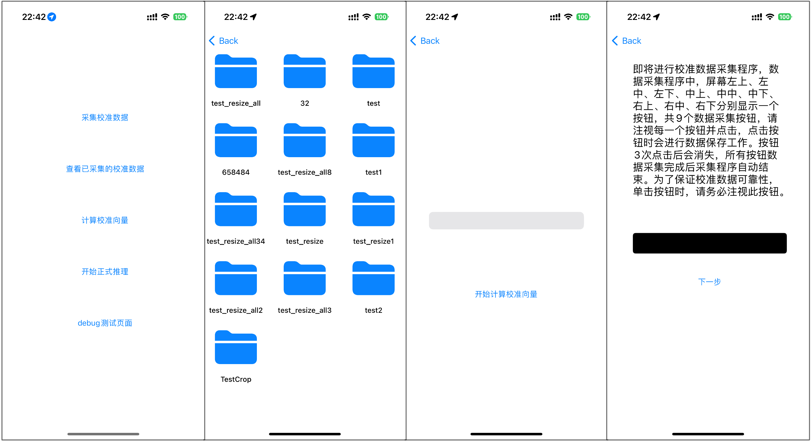

#  Gaze Estimation APP by CoreML IOS17 Vision




## pipeline:

- CVFundation -> Vision -> OpenCV -> CoreML


```
实现一个个性化注视估计模型的IOS端侧落地。
```
- 项目文件目录及逻辑介绍

开发过程可能比较漫长，我怕后面搞忘记了


- ViewController.swift
ViewController里面就是主界面

- ImageUtil.swift
提供了图片保存、面部推理相关函数。

- MLInferenceUtil.swift
提供了模型推理接口

- dataUtil.swift
提供了数据持久化接口，将校准向量MLMultiArray持久化

- testViewController.swift
测试VC

- ModelCaliViewController.swift
执行校准的VC

- CaliHelperViewController.swift
校准数据采集前的说明页面

- CameraViewController.swift
实际校准数据采集页面
控制校准数据采集页面的逻辑，简单来说就是九个点，采集27张校准数据保存到本地

- ImageGalleryViewController.swift
相册页面，查看采集好的校准数据


```
开发过程中的一些约定

校准数据使用FileManager存储在
/images/cali文件夹下，以jpg格式存储

推理后的校准向量存储在
/caliFeature文件夹下，以bin格式存储

```


### 打印当前camera支持的输出格式

```
分辨率: 192x144, 支持的帧率范围: 1.0-60.0
分辨率: 352x288, 支持的帧率范围: 1.0-60.0
分辨率: 480x360, 支持的帧率范围: 1.0-60.0
分辨率: 640x480, 支持的帧率范围: 1.0-60.0
分辨率: 960x540, 支持的帧率范围: 1.0-30.0
分辨率: 1024x768, 支持的帧率范围: 1.0-60.0
分辨率: 1280x720, 支持的帧率范围: 1.0-30.0
分辨率: 1280x720, 支持的帧率范围: 1.0-30.0
分辨率: 1280x720, 支持的帧率范围: 1.0-30.0
分辨率: 1280x720, 支持的帧率范围: 1.0-60.0
分辨率: 1280x720, 支持的帧率范围: 1.0-60.0
分辨率: 1280x720, 支持的帧率范围: 1.0-60.0
分辨率: 1280x720, 支持的帧率范围: 1.0-60.0
分辨率: 1280x720, 支持的帧率范围: 1.0-60.0
分辨率: 1280x720, 支持的帧率范围: 1.0-120.0
分辨率: 1280x720, 支持的帧率范围: 1.0-120.0
分辨率: 1440x1080, 支持的帧率范围: 1.0-60.0
分辨率: 1440x1080, 支持的帧率范围: 1.0-60.0
分辨率: 1920x1080, 支持的帧率范围: 1.0-30.0
分辨率: 1920x1080, 支持的帧率范围: 1.0-30.0
分辨率: 1920x1080, 支持的帧率范围: 1.0-30.0
分辨率: 1920x1080, 支持的帧率范围: 1.0-30.0
分辨率: 1920x1080, 支持的帧率范围: 1.0-60.0
分辨率: 1920x1080, 支持的帧率范围: 1.0-60.0
分辨率: 1920x1080, 支持的帧率范围: 1.0-60.0
分辨率: 1920x1080, 支持的帧率范围: 1.0-60.0
分辨率: 1920x1080, 支持的帧率范围: 1.0-60.0
分辨率: 1920x1080, 支持的帧率范围: 1.0-120.0
分辨率: 1920x1080, 支持的帧率范围: 1.0-120.0
分辨率: 1920x1440, 支持的帧率范围: 1.0-30.0
分辨率: 1920x1440, 支持的帧率范围: 1.0-30.0
分辨率: 1920x1440, 支持的帧率范围: 1.0-30.0
分辨率: 1920x1440, 支持的帧率范围: 1.0-30.0
分辨率: 1920x1440, 支持的帧率范围: 1.0-60.0
分辨率: 1920x1440, 支持的帧率范围: 1.0-60.0
分辨率: 3088x2316, 支持的帧率范围: 1.0-30.0
分辨率: 3088x2316, 支持的帧率范围: 1.0-30.0
分辨率: 3088x2316, 支持的帧率范围: 1.0-30.0
分辨率: 3840x2160, 支持的帧率范围: 1.0-30.0
分辨率: 3840x2160, 支持的帧率范围: 1.0-30.0
分辨率: 3840x2160, 支持的帧率范围: 1.0-30.0
分辨率: 3840x2160, 支持的帧率范围: 1.0-60.0
分辨率: 3840x2160, 支持的帧率范围: 1.0-60.0
分辨率: 3840x2160, 支持的帧率范围: 1.0-60.0
分辨率: 4032x3024, 支持的帧率范围: 1.0-30.0
分辨率: 4032x3024, 支持的帧率范围: 1.0-30.0

```
